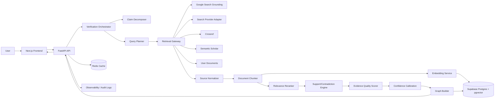
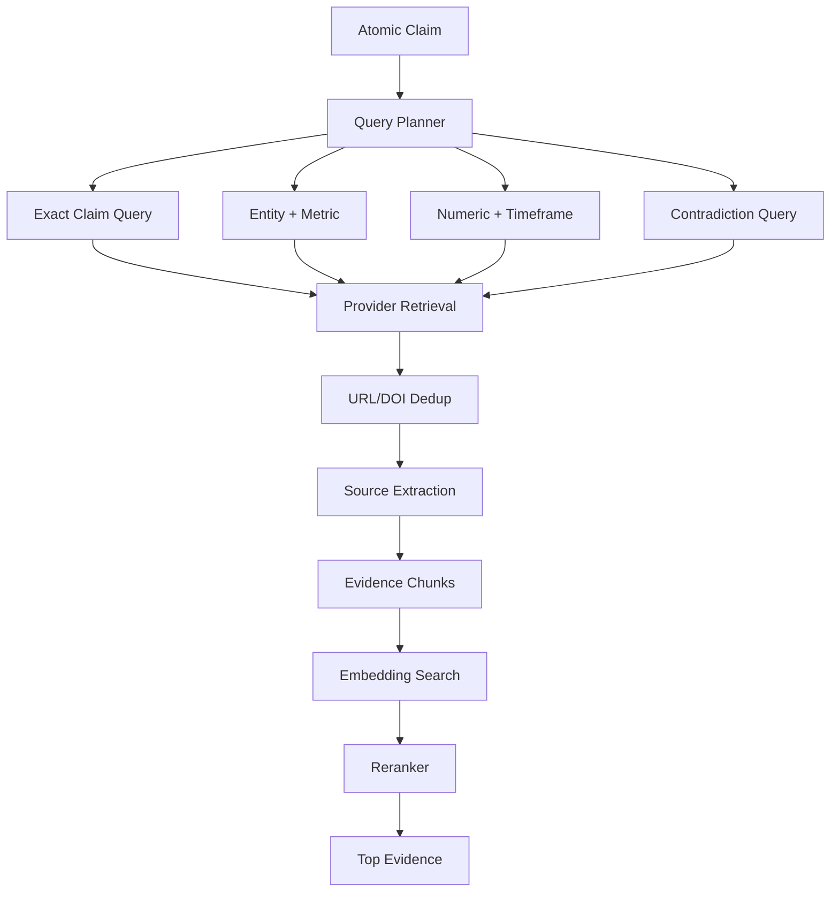
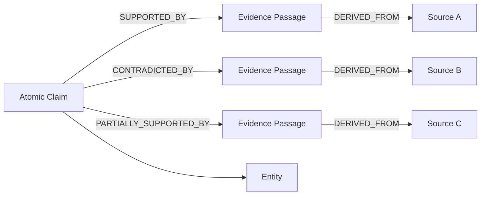
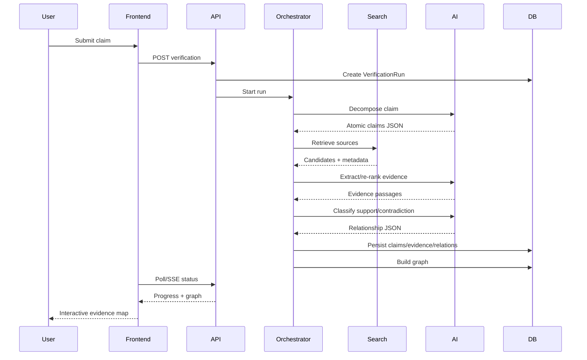
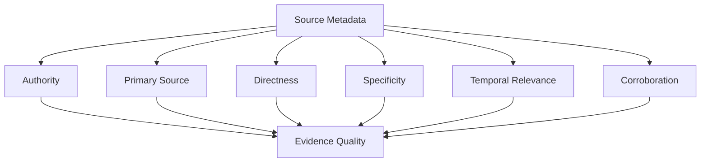
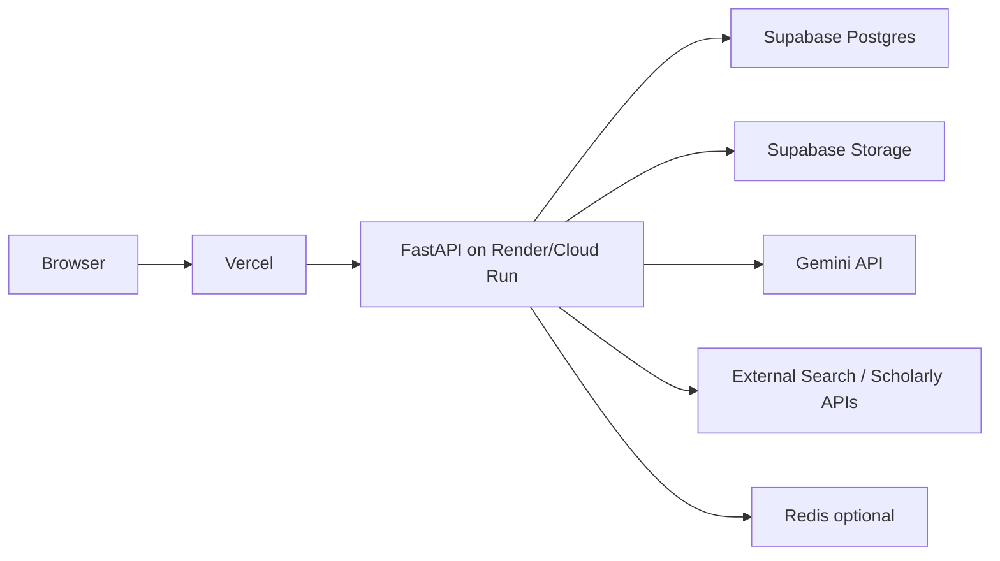

# PROOFCHAIN — System Architecture

**Version:** 1.0
**Deployment target:** Web application + API + managed Postgres/vector store

---

## 1. High-Level Architecture



---

## 2. Architectural Principles

### Evidence graph as system of record

The final answer is not the primary data model. The persistent objects are:

```text
Claim
Evidence
Source
Relationship
VerificationRun
```

The rendered report is derived from these objects.

### Pipeline over agent

Use a deterministic pipeline for the hackathon MVP:

```text
Decompose → Retrieve → Extract → Compare → Score → Graph → Render
```

Do not use an unconstrained autonomous agent for the core workflow.

This makes the product easier to test, explain, and demo.

---

## 3. Component Architecture

### A. Next.js Frontend

Responsibilities:

- claim input;
- verification status;
- graph rendering;
- evidence drawers;
- report generation;
- interaction analytics.

Never place secret API keys in browser code.

---

### B. FastAPI Gateway

Responsibilities:

- authentication/session handling;
- request validation;
- orchestration entrypoint;
- result APIs;
- rate limiting;
- SSE/WebSocket progress stream if needed.

---

### C. Verification Orchestrator

Coordinates the pipeline.

```python
async def verify(project_id, input_text):
    claims = await decompose(input_text)

    for claim in claims:
        queries = await plan_queries(claim)
        candidates = await retrieve(queries)
        sources = await normalize_sources(candidates)
        evidence = await extract_evidence(claim, sources)
        evidence = await rerank(claim, evidence)

        for item in evidence:
            relation = await classify_relation(claim, item)
            quality = score_quality(item.source, claim, item)
            persist(claim, item, relation, quality)

    return await build_verification_graph(project_id)
```

The actual implementation should execute independent claims concurrently with bounded concurrency.

---

### D. Claim Decomposer

```text
Input
 ↓
LLM structured JSON
 ↓
Pydantic validation
 ↓
Semantic sanity checks
 ↓
Atomic claim objects
```

Sanity checks:

- numeric preservation;
- negation preservation;
- entity preservation;
- timeframe preservation.

---

### E. Query Planner

Maps atomic claims to retrieval strategies.

```text
quantitative → numeric + entity + period queries
causal       → study + intervention + outcome queries
comparative  → A vs B + metric queries
attribution  → person + statement + date queries
```

This is a major technical differentiator from “search the text.”

---

### F. Retrieval Gateway

Use provider adapters:

```text
IRetrievalProvider
 ├── GoogleGroundingProvider
 ├── SearchProvider
 ├── CrossrefProvider
 ├── SemanticScholarProvider
 └── UserDocumentProvider
```

The orchestrator should not know provider-specific response formats.

---

## 4. Retrieval Strategy



### Hybrid retrieval formula

```text
R = α * lexical + β * vector + γ * entity + δ * temporal
```

Start with:

```text
α=.30
β=.45
γ=.15
δ=.10
```

Tune against the validation set.

---

## 5. Evidence Graph Architecture



### Why graph rather than flat table?

Because the product question is relational:

> Which exact evidence supports this exact part of this exact claim?

A graph naturally represents multiple sources, conflicting sources, shared evidence, entities, and claim hierarchies.

For the hackathon, PostgreSQL tables plus graph-shaped JSON are sufficient. A specialized graph database is not required.

---

## 6. Verification Sequence



---

## 7. Source Provenance Model

Every source should carry:

```json
{
  "canonical_url": "https://example.org/report",
  "title": "Annual Report 2025",
  "publisher": "Example Corp",
  "published_at": "2026-03-01",
  "accessed_at": "2026-09-23T18:31:11+05:30",
  "source_type": "primary_document",
  "retrieval_provider": "google_search",
  "content_hash": "sha256..."
}
```

Every evidence passage:

```json
{
  "source_id": "s1",
  "locator": {
    "page": 42,
    "section": "Energy"
  },
  "passage": "...",
  "hash": "sha256..."
}
```

This enables citation auditing.

---

## 8. Source Quality Subsystem



Important:

```text
Evidence Quality != Truth
```

A high-quality source can still report an incorrect claim. Conversely, an otherwise weak source can contain a correct observation. The product therefore keeps the two dimensions separate.

---

## 9. Confidence Pipeline

```text
Model raw score
      ↓
Rule validation
      ↓
Cross-model agreement
      ↓
Evidence quality weighting
      ↓
Calibration layer
      ↓
Displayed confidence
```

Example:

```text
NLI confidence          0.91
LLM review              0.88
Evidence quality        0.92
Cross-source agreement  0.80
Calibration              ↓
Displayed confidence    0.86
```

Do not expose the intermediate values as pseudo-precise truth probabilities; use them primarily for internal scoring and explainability.

---

## 10. Failure Architecture

### Search provider failure

```text
Provider A fails
      ↓
Provider B
      ↓
Provider C / scholarly providers
      ↓
partial_result = true
```

### Model failure

```text
Invalid JSON
 ↓
Schema validation
 ↓
Retry with constrained prompt
 ↓
Fallback parser / safe failure
```

### Source fetch failure

```text
Metadata only
 ↓
Evidence unavailable
 ↓
No relationship classification
 ↓
Display “unverified source access”
```

### Conflicting source scopes

```text
Conflict detected
 ↓
Scope comparison
 ├── same scope → contradiction
 └── different scope → apparent conflict
```

---

## 11. Security Architecture

```text
                    INTERNET
                       │
                       ▼
                Untrusted content
                       │
             ┌─────────┴─────────┐
             │ sanitizer/parser  │
             └─────────┬─────────┘
                       ▼
              isolated evidence
                       │
                 model prompt
                       │
             schema validation
                       │
                policy checks
                       ▼
                  database
```

Threats:

- prompt injection;
- malicious documents;
- SSRF through arbitrary URLs;
- XSS from source HTML;
- fake citations;
- poisoned evidence;
- data leakage;
- API abuse.

Controls:

- URL allow/deny policy;
- SSRF-safe fetcher;
- HTML sanitization;
- content-length/timeouts;
- no code execution from source content;
- strict output schemas;
- provenance checks;
- private storage controls.

OWASP's current GenAI Top 10 includes prompt injection, sensitive-information disclosure, data/model poisoning, improper output handling, vector/embedding weaknesses, misinformation, and other GenAI risks relevant to this architecture.

---

## 12. API / Service Boundaries

```text
Frontend
   │
REST/SSE
   │
API Gateway
   │
┌──┴──────────────────────────────┐
│ Verification Service            │
│ Claim Service                   │
│ Retrieval Service               │
│ Evidence Service                │
│ Scoring Service                 │
│ Graph Service                   │
│ Report Service                  │
└───────────────┬─────────────────┘
                │
        Postgres + pgvector
```

For the hackathon, these can remain modules inside one FastAPI application rather than separate deployable microservices.

---

## 13. Scalability Path

### MVP

```text
Vercel
  +
FastAPI
  +
Supabase
```

### 10× traffic

Add:

```text
Redis
Background workers
Result cache
Provider-level rate limits
```

### 100× traffic

Split workloads:

```text
API
Retrieval workers
Embedding workers
Classification workers
Report workers
```

Use queue-based orchestration and idempotent jobs.

### Million-scale evidence store

Use:

- partitioned Postgres tables;
- dedicated vector infrastructure where justified;
- content-addressable storage;
- distributed retrieval;
- precomputed embeddings;
- document freshness jobs.

---

## 14. Cost-Control Architecture

Minimize expensive model calls:

```text
Cheap deterministic filters
       ↓
Embeddings / lexical retrieval
       ↓
Small top-k
       ↓
NLI/reranker
       ↓
LLM only for ambiguous cases
```

Use structured output only where needed.

Cache embeddings and normalized source metadata.

Do not send 30 full webpages into an LLM. Retrieve and rank targeted passages first.

---

## 15. Recommended Repository Architecture

```text
proofchain/
│
├── apps/
│   ├── web/
│   │   ├── app/
│   │   ├── components/
│   │   ├── lib/
│   │   └── styles/
│   │
│   └── api/
│       ├── routes/
│       ├── services/
│       ├── models/
│       ├── schemas/
│       ├── providers/
│       ├── scoring/
│       ├── retrieval/
│       ├── prompts/
│       └── workers/
│
├── packages/
│   ├── contracts/
│   └── ui/
│
├── data/
│   ├── seed/
│   └── evaluation/
│
├── supabase/
│   └── migrations/
│
├── docs/
│   ├── PRD.md
│   ├── TRD.md
│   ├── Design.md
│   └── Architecture.md
│
├── scripts/
│   ├── seed_demo.py
│   └── evaluate.py
│
├── .env.example
├── docker-compose.yml
└── README.md
```

---

## 16. Deployment Architecture



Environment variables:

```text
GEMINI_API_KEY
SUPABASE_URL
SUPABASE_SERVICE_ROLE_KEY
CROSSREF_MAILTO
SEMANTIC_SCHOLAR_API_KEY
SEARCH_PROVIDER_KEY
REDIS_URL
```

Never commit these values.

---

## 17. Observability Architecture

Every run emits:

```text
verification.created
claim.decomposed
query.generated
retrieval.completed
source.normalized
evidence.extracted
evidence.reranked
relationship.classified
quality.scored
graph.built
report.generated
verification.completed
```

Each event references `verification_id` and `claim_id` where applicable.

---

## 18. Architecture Decisions

### ADR-001
**Postgres + pgvector instead of a dedicated graph DB.**

Reason: fast hackathon delivery, transactional consistency, vector search, SQL analytics, and easier deployment.

### ADR-002
**Pipeline instead of fully autonomous agent.**

Reason: determinism, auditability, easier testing, bounded cost.

### ADR-003
**Separate relation score from source quality.**

Reason: “supports claim” and “source is authoritative” answer different questions.

### ADR-004
**Evidence passage stored verbatim/traceably rather than only summarized.**

Reason: citation auditability.

### ADR-005
**Model outputs are schema validated.**

Reason: prevent malformed or ambiguous downstream states.

### ADR-006
**Contradiction is a first-class result.**

Reason: disagreement itself is useful information.

---

## 19. Demo Dataset Architecture

Create 3 polished demo scenarios:

### Scenario A — Quantitative claim

```text
“Organization X reduced electricity consumption by 40% in 2025.”
```

Expected:

- exact numeric match;
- primary source support;
- supporting secondary source.

### Scenario B — Conflicting evidence

Two sources report different values for the same metric.

Expected:

- support + contradiction edges;
- scope comparison;
- “mixed evidence” aggregate state.

### Scenario C — Missing evidence

A polished-looking claim with weak/irrelevant sources.

Expected:

- low coverage;
- evidence-gap explanation;
- no fabricated confidence.

These three demos prove that the product does more than “find supporting links.”

---

## 20. Judge-Facing Technical Story

A judge asking:

> “Isn't this just an LLM with search?”

should get this architecture answer:

```text
No.

LLM                  → structured claim decomposition
Retrieval            → hybrid lexical + vector search
Source adapters      → independent external metadata
Reranker             → evidence selection
NLI                  → claim/evidence relationship
Quality model        → source-quality dimension
Calibration          → confidence reliability
Graph engine         → provenance structure
UI                   → inspectable evidence chain
```

That distinction is central to the technical narrative.

---

## 21. Production Evolution

Future architecture can add:

```text
Browser extension
      ↓
Claim extraction from page
      ↓
Continuous evidence monitoring
      ↓
Claim versioning
      ↓
Changed-source detection
      ↓
Evidence graph history
```

At scale, PROOFCHAIN can become an **evidence API** for other products:

```text
POST /verify-claim
       ↓
Evidence graph JSON
       ↓
Third-party application
```

