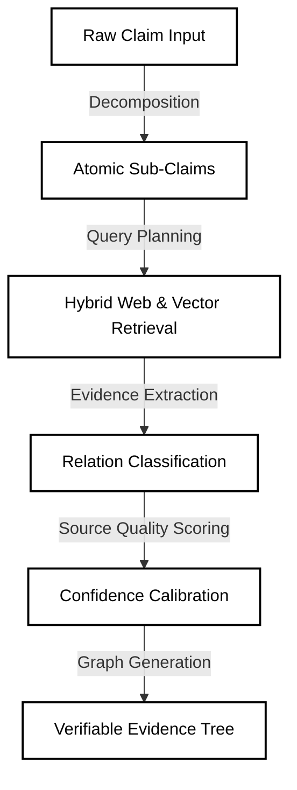

<div align="center">
  <br/>
  <h1>⛓️ PROOFCHAIN</h1>
  <p>
    <strong>Evidence before belief.</strong>
  </p>
  <p>
    An intelligent, agentic fact-checking platform that transforms complex claims into verifiable, auditable evidence graphs using advanced AI and retrieval pipelines.
  </p>
  <br/>
  <p>
    
    
    
    
    
  </p>
</div>

<br/>

## 🌟 The Vision

In a world overwhelmed by information, **ProofChain** acts as the central hub for investigators, journalists, and critical thinkers. We don't just give you a "truth score"—we map out how strongly retrieved evidence from across the web supports, contradicts, or fails to address atomic claims within complex statements.

No hallucinations. Just facts.

---

## ⚡ Core Pipeline

The backend utilizes an advanced multi-step LLM pipeline to decompose claims and execute semantic search:



---

## 🚀 Key Features

* **Agentic Fact-Checking**: Automatically breaks down large articles or statements into verifiable pieces.
* **Cinematic User Experience**: Built with modern web aesthetics, glassmorphism, and smooth GSAP/Framer Motion animations. 
* **Multi-modal Input**: Submit claims via raw text, voice dictation, or file uploads.
* **Evidence Graphs**: Visualizes the journey from claim to contradiction/support using interactive nodes.
* **1-Click Render Deployment**: Fully defined Infrastructure as Code (`render.yaml`) for immediate cloud deployment.

---

## 🛠️ Tech Stack

### Frontend (`apps/web`)
* **Framework**: Next.js 16 (App Router)
* **Styling**: Tailwind CSS & Custom CSS
* **Animations**: GSAP & Motion (Framer)
* **Icons**: Lucide React
* **UI Components**: React Bits

### Backend (`apps/api`)
* **Framework**: FastAPI (Python 3.12)
* **AI & LLM**: OpenAI & Custom Semantic Retrievers
* **Database**: PostgreSQL (via Supabase)
* **Vector Store**: pgvector
* **ORM**: SQLAlchemy

---

## 💻 Local Development

ProofChain is structured as a monorepo containing both the frontend client and the backend API.

### Prerequisites
- Node.js (v20+)
- Python (3.12+)
- A Supabase project (for PostgreSQL/pgvector)
- An OpenAI API Key

### 1. Start the FastAPI Backend
```bash
cd apps/api
python -m venv venv
source venv/bin/activate  # On Windows use `venv\Scripts\activate`
pip install -r requirements.txt
```

Create an `apps/api/.env` file:
```env
OPENAI_API_KEY=your_api_key_here
SUPABASE_URL=your_supabase_url
SUPABASE_KEY=your_supabase_key
```

Run the server:
```bash
uvicorn main:app --reload --port 8000
```
*The API will be available at `http://localhost:8000`*

### 2. Start the Next.js Frontend
```bash
cd apps/web
npm install
```

Create an `apps/web/.env.local` file:
```env
NEXT_PUBLIC_API_URL=http://localhost:8000
```

Run the development server:
```bash
npm run dev
```
*The UI will be available at `http://localhost:3000`*

---

## ☁️ Deployment (Render)

Deploying both the API and the Web frontend is fully automated via Render Blueprints. 

1. Ensure your code is pushed to GitHub.
2. Sign in to [Render](https://render.com/).
3. Go to **Blueprints** → **New Blueprint Instance**.
4. Connect this repository. Render will read the `render.yaml` file at the root, prompt you for the necessary API keys, and spin up both services simultaneously.

---

## 📚 Documentation & Architecture
Dive deeper into the engineering and design behind ProofChain:

- [Product Requirements Document (PRD)](PRD.md)
- [Technical Requirements Document (TRD)](TRD.md)
- [System Architecture](Architecture.md)
- [UI/UX Design System](Design.md)

---

<div align="center">
  <p>Built with 🤍 for truth-seekers everywhere.</p>
  <p>© 2026 ProofChain AI</p>
</div>
